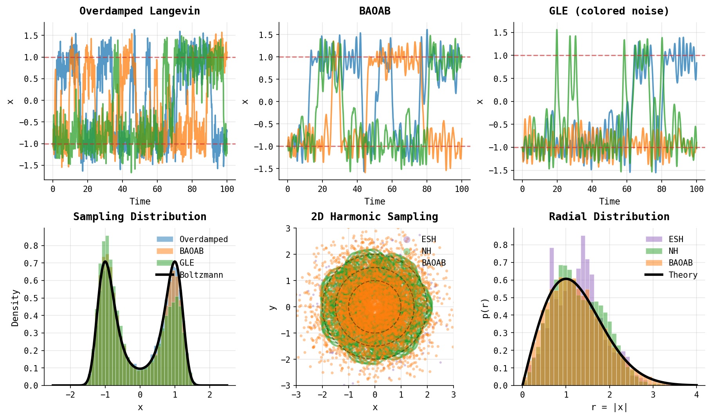
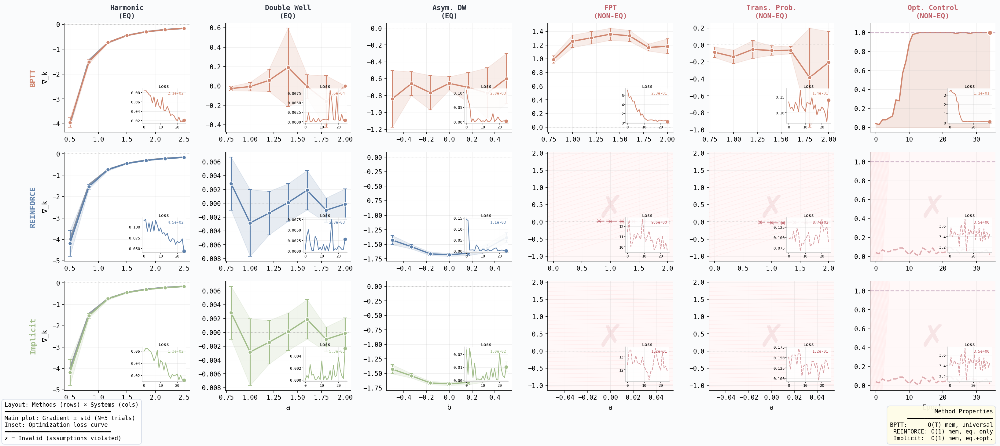
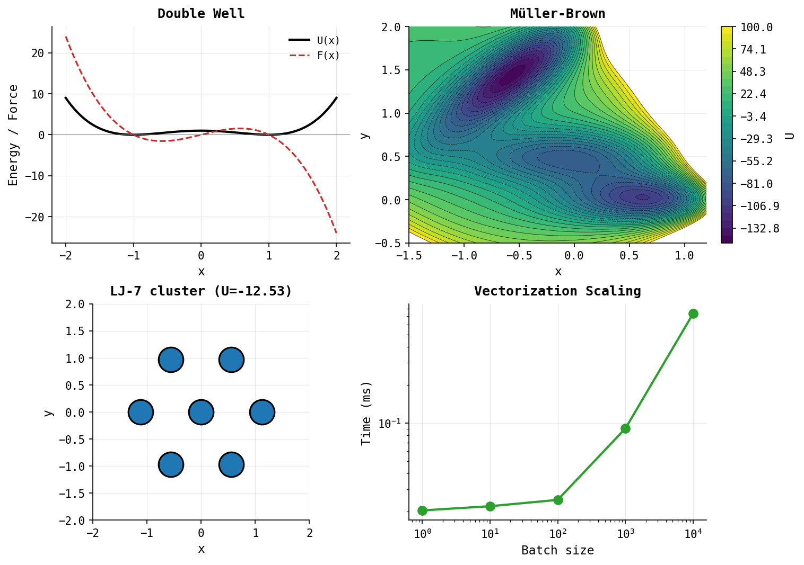

# on unifying differentiable simulations

> “All chaos is order misunderstood.”    — Alexander Pope

This project explores a question I've wondered about for years:

> What does it mean to "differentiate through simulation"?


```bash
pip install -e ".[dev]"
```


## Benchmark implemented simulators




| Integrator | Type | Notes |
|------------|------|-------|
| `OverdampedLangevin` | Stochastic | High friction |
| `BAOAB` | Stochastic | NVT sampler |
| `VelocityVerlet` | Deterministic | NVE, symplectic |
| `NoseHoover` | Deterministic | NVT thermostat, **adjoint methods available** |
| `NoseHooverChain` | Deterministic | NVT thermostat chain |
| `ESH` | Deterministic | Non-Newtonian kinetic energy ([arXiv:2111.02434](https://arxiv.org/abs/2111.02434)) |
| `GLE` | Stochastic | Colored noise |


## Gradient Estimators



Three approaches for computing gradients through stochastic simulations:

| Method | Memory | Equilibrium | Non-Equilibrium | Notes |
|--------|--------|-------------|-----------------|-------|
| **BPTT** | O(T) | ✓ | ✓ | Universal, backprop through trajectory |
| **REINFORCE** | O(1) | ✓ | ✗ | Score function / TPT, equilibrium only |
| **Implicit** | O(1) | ✓ | ✗ | Implicit differentiation, equilibrium only |

The REINFORCE estimator uses the thermodynamic perturbation theory identity:
```
∇_θ ⟨O⟩ = -β Cov(O, ∇_θU) = -β [⟨O ∇_θU⟩ - ⟨O⟩⟨∇_θU⟩]
```

**Key findings** (see plot above):
- **Equilibrium systems** (Harmonic, Double Well, Asymmetric DW): All three methods agree
- **Non-equilibrium systems** (First Passage Time, Transition Probability, Optimal Control): Only BPTT provides valid gradients; REINFORCE and Implicit fail (marked with ✗)
- **Trade-off**: BPTT is universal but memory-intensive; REINFORCE/Implicit are O(1) memory but restricted to equilibrium observables

```bash
python scripts/gradient_methods_comparison.py  # Generate the comparison plot
```

## Adjoint Methods (implemented for Nose hoover)


For deterministic thermostats like Nosé-Hoover, we provide specialized adjoint methods:

| Method | Memory | Accuracy | Notes |
|--------|--------|----------|-------|
| **BPTT** | O(T) | Exact | Backprop through discrete operations |
| **Continuous Adjoint** | O(1)* | O(dt) | Solves adjoint ODEs backward |
| **Discrete Adjoint** | O(T) | Exact | Differentiates discrete scheme exactly |

*O(T) for trajectory storage

**Key findings**:
- **Discrete adjoint matches BPTT to machine precision** (~10⁻⁷ relative error)
- **Continuous adjoint has O(dt) error** (~5-15% at dt=0.01, decreases linearly with dt)
- Both methods enable gradient-based optimization of thermostat parameters (kT, mass, Q)

```python
from uni_diffsim.gradient_estimators import DiscreteAdjointNoseHoover

# Exact gradients for Nosé-Hoover (matches BPTT)
integrator = DiscreteAdjointNoseHoover(kT=1.0, mass=1.0, Q=1.0)
traj_x, traj_v, traj_alpha = integrator.run(x0, v0, force_fn, dt=0.01, n_steps=100)

# Compute gradients via discrete adjoint
loss_grad = 2 * traj_x[-1]  # gradient of x².sum()
grads = integrator.adjoint_backward([loss_grad], [None], traj_x, traj_v, traj_alpha, force_fn, dt)
# grads['kT'], grads['mass'], grads['Q'] match BPTT exactly
```

```bash
python scripts/nosehoover_adjoint_demo.py  # Generate the adjoint comparison plot
```

## Potentials



| Potential | Dim | Use |
|-----------|-----|-----|
| `DoubleWell` | 1D | Barrier crossing |
| `AsymmetricDoubleWell` | 1D | Metastable populations |
| `MullerBrown` | 2D | Reaction paths |
| `LennardJones` | N×d | Clusters |
| `Harmonic` | d | Reference |


## Usage

```python
import torch
from uni_diffsim import DoubleWell, BAOAB, ESH

# Setup
potential = DoubleWell()
x0 = torch.randn(100, 1)  # 100 particles

# Stochastic sampling
baoab = BAOAB(gamma=1.0, kT=0.5)
traj_x, traj_v = baoab.run(x0, None, potential.force, dt=0.01, n_steps=1000)

# Deterministic ergodic sampling (2D+)
x0_2d = torch.randn(10, 2)
esh = ESH(eps=0.1)
traj_x, traj_u, traj_r = esh.run(x0_2d, None, lambda x: -potential.force(x), n_steps=1000)

# Gradients work
k = torch.tensor([1.0], requires_grad=True)
x = torch.tensor([[1.0]])
for _ in range(10):
    x, _, _ = esh.step(x, torch.randn(1, 1), torch.zeros(1), lambda x: k * x)
x.sum().backward()  # k.grad is defined
```

## Tests

```bash
pytest tests/ -v
```

