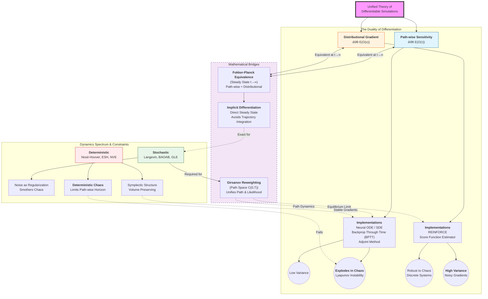

# Unified Theory of Differentiable Molecular Simulations

## Research Vision

Establish a unified theoretical framework that integrates differentiable simulation methods across different contexts (stochastic dynamics, deterministic thermostats, geometry-preserving algorithms), revealing their intrinsic connections and providing systematic experimental validation.

---

## Part I: Theoretical Framework

### Conceptual Atlas



### 1. Core Problem: The Duality of Differentiation

In molecular simulations, "differentiating with respect to parameter θ" exists in two fundamentally different but mathematically equivalent paradigms:

#### 1.1 Path-wise Sensitivity

$$\frac{\partial}{\partial \theta} \mathbb{E}_{p(\tau|\theta)}[O(\tau)] = \mathbb{E}\left[\frac{\partial O}{\partial \tau} \cdot \frac{\partial \tau}{\partial \theta}\right]$$

- **Implementation**: Neural ODE/SDE, Backpropagation Through Time (BPTT), Adjoint Method
- **Advantage**: Low variance (when trajectories are smooth)
- **Problem**: Gradient explosion in chaotic systems (Lyapunov exponent > 0)

#### 1.2 Distributional Gradient

$$\frac{\partial}{\partial \theta} \mathbb{E}_{\rho(x|\theta)}[O(x)] = \mathbb{E}\left[O(x) \cdot \nabla_\theta \log \rho(x|\theta)\right]$$

- **Implementation**: REINFORCE, Score Function Estimator
- **Advantage**: Does not require differentiable trajectories, suitable for discrete/chaotic systems
- **Problem**: High variance

#### 1.3 Mathematical Bridge (Steady State)

**Theorem (Fokker-Planck Equivalence)**: For ergodic systems, as $t \to \infty$:

$$\lim_{t \to \infty} \frac{\partial}{\partial \theta} \mathbb{E}[O(x_t)] = \int O(x) \nabla_\theta \rho_{eq}(x|\theta) dx$$

The two paradigms are equivalent in the steady-state limit, but finite-time behavior differs significantly.

**Score Function Connection**:
- Score of the stationary distribution: $s(x) = \nabla_x \log \rho_{eq}(x)$
- For Boltzmann distribution: $s(x) = -\beta \nabla_x U(x) = \beta F(x)$
- Score estimation can bypass the computation of normalization constants

#### 1.4 The Girsanov Bridge (Path Space)

Girsanov Reweighting unifies the paradigms by defining the "Score Function" for an entire trajectory $\tau$. For a Langevin SDE $dx = F_\theta(x)dt + \sigma dW$:

$$ \nabla_\theta \log p(\tau) = \int_0^T \frac{1}{\sigma^2} \nabla_\theta F(x_t) \cdot (dx_t - F(x_t)dt) $$

- **Bridge**: It captures path dynamics (like BPTT) via the time-integral, but uses a likelihood-ratio formulation (like REINFORCE).
- **Malliavin Calculus**: Allows trading regularity of the observable (required for BPTT) for regularity of the noise (required for Girsanov).

#### 1.5 Constraints & Applicability

The distributional/reweighting approach imposes strict constraints on the underlying dynamics:

1. **Stochastic Requirement (Ellipticity)**:
   - **Required**: SDEs (Langevin) where noise "smooths" transitions.
   - **Incompatible**: Pure ODEs (NVE, Nosé-Hoover) have Dirac delta transition probabilities, making path densities undefined.

2. **Drift-Only Constraint (Absolute Continuity)**:
   - **Valid**: Reweighting changes in Force/Potential (Drift).
   - **Invalid**: Reweighting changes in Temperature/Friction (Diffusion). Two diffusion processes with different noise scales are mutually singular.

3. **Integrator Compatibility**:
   - The discrete scheme must induce a differentiable transition density (e.g., Euler-Maruyama).
   - Symplectic integrators or rigid constraints may restrict noise to a subspace, complicating the application of Girsanov.

---

### 2. Spectrum of Dynamical Systems

Different dynamical equations shape different loss landscapes and gradient properties:

| Dynamics Type | Equation | Ergodicity | Gradient Stability | Application Scenario |
|---------------|----------|------------|-------------------|---------------------|
| Overdamped Langevin | $dx = F dt + \sqrt{2D} dW$ | ✓ (noise-guaranteed) | Medium | High friction limit |
| Underdamped Langevin | $\begin{cases} dx = v dt \\ dv = F dt - \gamma v dt + \sqrt{2\gamma T} dW \end{cases}$ | ✓ | Good | Physical MD |
| Nosé-Hoover | $\begin{cases} \dot{x} = v \\ \dot{v} = F - \zeta v \\ \dot{\zeta} = (K - K_{target})/Q \end{cases}$ | Conditional | Chaos-sensitive | Deterministic sampling |
| ESH Dynamics | Hamiltonian flow on energy shell | ✓ (geometry-guaranteed) | Excellent | Long-range stability |
| GLE | $\dot{v} = F - \int_0^t K(t-s)v(s)ds + \eta(t)$ | ✓ | Tunable | Multi-scale systems |

#### 2.1 Noise as Regularization

The noise term in stochastic dynamics acts as natural regularization:
- Prevents gradient explosion along unstable directions
- Provides exploration, avoiding local minima
- Noise strength ↔ Temperature ↔ Regularization strength

#### 2.2 Challenges of Deterministic Chaos

Deterministic thermostats like Nosé-Hoover produce chaotic trajectories in phase space:
- After Lyapunov time $\tau_L \sim 1/\lambda_{max}$, path-wise sensitivity fails
- However, ergodicity guarantees convergence of long-time statistics
- **Key insight**: Need to shift from path-wise to distributional perspective

#### 2.3 Geometric Structure Preservation

Advantages of ESH and Symplectic algorithms:
- Symplecticity → Phase space volume conservation → No long-term drift
- Energy preservation → Stable Hamiltonian → Non-divergent gradients
- arXiv:2306.07961 shows that symplectic integrators can significantly reduce long-term gradient drift

---

### 3. Gradient Computation Paradigms

#### 3.1 Explicit Differentiation

**BPTT (Backpropagation Through Time)**
```
∂L/∂θ = Σ_t (∂L/∂x_t) · (∂x_t/∂x_{t-1}) · ... · (∂x_1/∂θ)
```
- Memory: O(T) or O(√T) with checkpointing
- Problem: Gradient chain length T → Lyapunov explosion

**Adjoint Method**
```
dλ/dt = -λ · (∂f/∂x), integrated backward
∂L/∂θ = ∫ λ · (∂f/∂θ) dt
```
- Memory: O(1) theoretically
- Practice: Requires storing forward trajectory or recomputation

#### 3.2 Implicit Differentiation

**Core idea** (arXiv:2105.15183): Bypass trajectory integration, directly differentiate the steady-state condition.

For stationary distribution $\rho_{eq}(x|\theta)$ satisfying $\mathcal{L}^\dagger \rho_{eq} = 0$, where $\mathcal{L}$ is the Fokker-Planck operator:

$$\frac{\partial \langle O \rangle}{\partial \theta} = \langle O \cdot \nabla_\theta \log \rho_{eq} \rangle$$

**Connection to Contrastive Divergence**:
- CD is also an approximation method that avoids complete sampling
- Implicit differentiation can be viewed as the exact version of "infinite-step CD"

#### 3.3 Reweighting Methods (REINFORCE & Girsanov)

**Differentiable Trajectory Reweighting (REINFORCE)**
Leverages Thermodynamic Perturbation Theory (TPT) to bypass trajectory differentiation for equilibrium observables. Instead of backpropagating through time, it reweights the stationary distribution directly:

$$ \nabla_\theta \langle O \rangle = -\beta \text{Cov}_{\rho_\theta}(O, \nabla_\theta U) = -\beta \left[ \langle O \nabla_\theta U \rangle - \langle O \rangle \langle \nabla_\theta U \rangle \right] $$

**Connection to Girsanov Theorem**:
- **Girsanov Reweighting**: Operates in **path space** ($C[0, T]$). Reweights the entire trajectory probability based on changes in drift/diffusion. It is the dynamic generalization but suffers from exponential variance growth (weight collapse) over time.
- **REINFORCE**: Operates in **configuration space** ($\mathbb{R}^{3N}$). It is the **equilibrium limit** of Girsanov reweighting, assuming ergodicity. It effectively "collapses" the path integral to single-time snapshots, offering much lower variance for static properties.

---

### 4. Statistical Physics Properties of Gradients

#### 4.1 Variance-Bias Tradeoff

| Method | Bias | Variance | Applicable Conditions |
|--------|------|----------|----------------------|
| Reparameterization | Low | Low | Smooth differentiable trajectories |
| REINFORCE | None | High | Any system |
| Rao-Blackwellization | None | Medium | Decomposable structure |
| Control Variates | Tunable | Tunable | Requires baseline function |

#### 4.2 Chaos and Lyapunov Exponents

For chaotic systems, perturbation $\delta x$ grows as:
$$|\delta x(t)| \sim |\delta x(0)| e^{\lambda_{max} t}$$

SNR decay of gradient estimation:
$$\text{SNR}(t) \sim e^{-\lambda_{max} t}$$

**Mitigation strategies**:
1. Truncate time window
2. Add noise (stochastization)
3. Use distributional methods
4. Implicit differentiation (skip trajectory)

#### 4.3 Girsanov Theorem and Measure Transformation

For parameter change $\theta \to \theta + \delta\theta$, the change in trajectory distribution can be described via Girsanov transformation:
$$\frac{d\mathbb{P}_{\theta+\delta\theta}}{d\mathbb{P}_\theta} = \exp\left(\int_0^T \Delta b \cdot dW - \frac{1}{2}\int_0^T |\Delta b|^2 dt\right)$$

This provides the theoretical foundation for importance sampling and reweighting.

---

## Part II: Systematic Experimental Framework

### 5. Benchmark Systems

#### 5.1 1D Double Well (Metastability Test)

$$U(x) = (x^2 - 1)^2$$

**Test objectives**:
- Can gradients drive the system across energy barriers
- Kramers escape time vs gradient response time
- Shadow work accumulation vs timestep relationship

**Differentiable tasks**:
- Optimize potential parameters to maximize transition rate
- Learn optimal protocol $\lambda(t)$ to minimize work

#### 5.2 2D Müller-Brown Potential (Reaction Path Test)

$$U(x,y) = \sum_{i=1}^4 A_i \exp[a_i(x-x_i^0)^2 + b_i(x-x_i^0)(y-y_i^0) + c_i(y-y_i^0)^2]$$

**Test objectives**:
- Can gradients identify the correct reaction channel
- Ability to distinguish multiple transition states
- Comparison with String Method / NEB

**Differentiable tasks**:
- End-to-end learning of reaction coordinates
- Optimize collective variables (CV)

#### 5.3 N-Particle Lennard-Jones Cluster

$$U = 4\epsilon \sum_{i<j} \left[\left(\frac{\sigma}{r_{ij}}\right)^{12} - \left(\frac{\sigma}{r_{ij}}\right)^6\right]$$

**Test objectives**:
- Gradient stability under many-body interactions
- Impact of saddle point structure on loss landscape
- Chaos onset vs particle number N

**Differentiable tasks**:
- Force field parameter fitting
- Structure optimization

#### 5.4 Alanine Dipeptide (Real Molecule Test)

**Test objectives**:
- Gradient flow in high-dimensional systems
- Sampling in φ-ψ dihedral angle space
- Integration with enhanced sampling methods

---

### 6. Evaluation Metrics System

#### 6.1 Gradient Quality Metrics

**Gradient SNR (Signal-to-Noise Ratio)**
$$\text{SNR} = \frac{|\mathbb{E}[\nabla_\theta L]|}{\sqrt{\text{Var}[\nabla_\theta L]}}$$

**Gradient Norm Stability**
$$\text{Stability} = \frac{\text{Var}[\|\nabla L\|]}{\mathbb{E}[\|\nabla L\|]^2}$$

**Effective Gradient Dimension**
$$d_{eff} = \frac{(\sum_i \lambda_i)^2}{\sum_i \lambda_i^2}$$
where $\lambda_i$ are Hessian eigenvalues.

#### 6.2 Sampling Efficiency Metrics

**Effective Sample Size (ESS)**
$$\text{ESS} = \frac{(\sum_i w_i)^2}{\sum_i w_i^2}$$

**Integrated Autocorrelation Time**
$$\tau_{int} = \frac{1}{2} + \sum_{t=1}^\infty \rho(t)$$

**Mixing Time**
$$\tau_{mix} = \inf\{t : \|p_t - \pi\|_{TV} < \epsilon\}$$

#### 6.3 Computational Efficiency Metrics

**Wall-clock Time per Gradient**

**Memory Footprint**

**Gradient-to-Noise Ratio per FLOP**

---

### 7. Experimental Matrix Design

#### 7.1 Dynamics × Gradient Method Cross-Validation

| | BPTT | Adjoint | Implicit | Reweighting |
|---|------|---------|----------|-------------|
| Overdamped Langevin | ✓ | ✓ | ✓ | ✓ |
| BAOAB | ✓ | ✓ | ✓ | ✓ |
| Nosé-Hoover | ✓ | ✓ | ✓ | - |
| ESH | ✓ | ✓ | ✓ | - |

#### 7.2 Timescale Sweep

For each combination, sweep:
- Integration timestep $\Delta t$: 0.001 → 1.0 (relative to characteristic time)
- Total simulation time $T$: 10 → 10000 (relative to relaxation time)
- Number of trajectories $N_{traj}$: 1 → 10000

#### 7.3 Chaos Degree Sweep

Control Lyapunov exponent by tuning system parameters:
- LJ cluster: N = 3, 7, 13, 55 (magic numbers)
- Double well: Barrier height
- Thermostat: Coupling strength


## Part IV: Research Roadmap

### Phase 1: Infrastructure (Month 1-2)

- [ ] Implement core dynamics engines (Langevin, BAOAB, NHC, ESH)
- [ ] Implement four gradient computation methods
- [ ] Set up benchmark systems (1D/2D potentials)
- [ ] Establish evaluation metrics computation pipeline

### Phase 2: Systematic Experiments (Month 3-4)

- [ ] Complete dynamics × gradient method cross-validation
- [ ] Timescale sweep experiments
- [ ] Chaos degree sweep experiments
- [ ] Collect and analyze data

### Phase 3: Theoretical Deepening (Month 5-6)

- [ ] Establish unified mathematical framework
- [ ] Prove key theorems (equivalence, convergence)
- [ ] Discover new theoretical connections

### Phase 4: Real System Validation (Month 7-8)

- [ ] Alanine dipeptide testing
- [ ] Comparison with existing methods (JAX-MD, TorchMD)
- [ ] Performance optimization

### Phase 5: Paper Writing (Month 9-10)

- [ ] Write theory section
- [ ] Organize experimental results
- [ ] Prepare reproducible code package

---

## Appendix: Core References

### Theoretical Foundations
1. **Implicit Differentiation**: arXiv:2105.15183 - Differentiating through equilibrium
2. **Symplectic Gradients**: arXiv:2306.07961 - Symplectic integrators for gradient computation
3. **ESH Dynamics**: arXiv:2111.02434 - Energy-shell Hamiltonian dynamics

### Differentiable Simulations
4. **JAX-MD**: arXiv:1912.04232 - Schoenholz & Cubuk
5. **TorchMD**: arXiv:2003.00868 - Differentiable molecular simulations
6. **Neural ODE**: arXiv:2001.01328 - Adjoint methods

### Non-equilibrium Statistical Mechanics
7. **Shadow Work**: Sivak, Chodera, Crooks (PRX 2013)
8. **Jarzynski Equality**: Jarzynski (PRL 1997)
9. **Crooks Fluctuation Theorem**: Crooks (PRE 1999)

### Score Estimation
10. **Score Matching**: Nature Comm. 2021 - Score-based sampling
11. **Diffusion Models**: Song et al. - Score-based generative modeling

---

## Expected Contributions

1. **Theoretical Unification**: First systematic integration of path-wise and distributional gradients, explicit and implicit differentiation, stochastic and deterministic dynamics into a unified framework

2. **Experimental Benchmarks**: Provide a standardized benchmark suite for evaluating different differentiable simulation methods

3. **Practical Guidelines**: Provide method selection guidelines for different application scenarios (force field training, enhanced sampling, optimal control)

4. **Open Source Tools**: Release a modular, extensible software package to lower the barrier to using differentiable simulations
